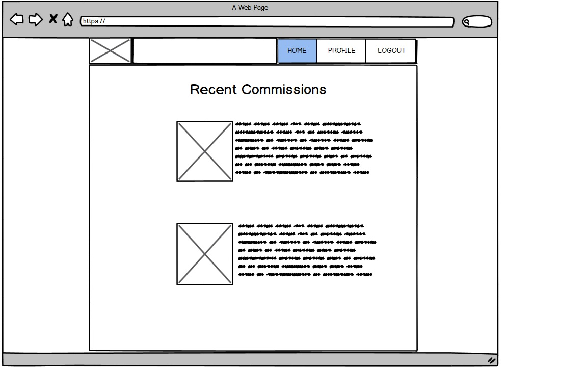
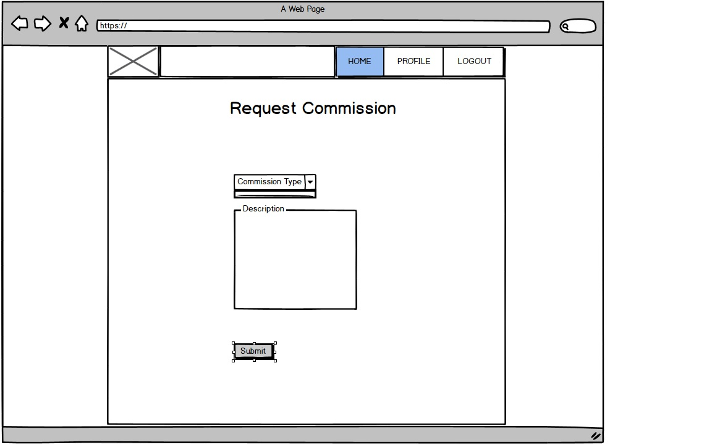
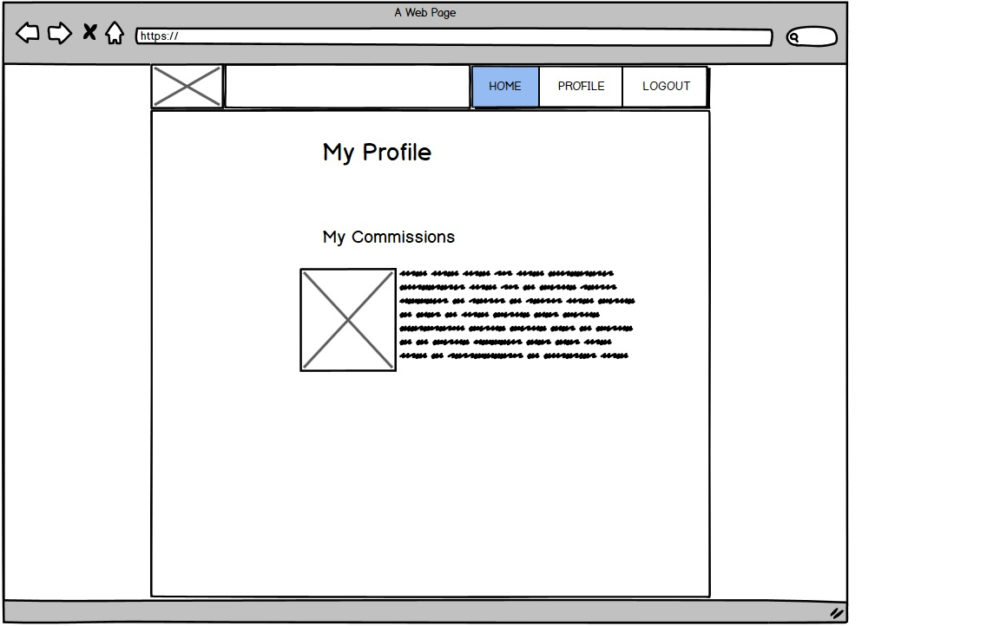

# Full Stack Frameworks Project

This project is an website for requesting commissions of art projects. The goal was to make a site utilising the Django web framework. Users should be able to login/register with the site, interact with the site's backend database via the website and be able to gain additional functionality by completing monetary transactions.

This is the fourth project as part of my [Code Institute](https://codeinstitute.net/) online diploma course.

---

## User Experience Design

### User Stories

These are potential actions that users of the website would want to perform. 

* As a user, I would like login/logout/register to the site.
* As a user, I would like to request an art commission.
* As a user, I would like to pay for my commission so I can receive it.

---

### Wireframes

## Database

Artists need to know certain information about the commission in order to begin their work. The description of the item requested is particularly important, as well as the type of item it should be (eg. painting, sculpture). The data required for the commission object is can be summarised:

* Name (the name the user gives their piece)
* Description (which the artist uses to complete the commission)
* Owner (which user requested the commission)
* Type (the type of work the commission should be)
* Paid (a value to determine if the user has paid for a particular commission)

The owner is a foreign key in the database which links to the django User class for the user that requested the commission. The type is also a foreign key of a class called CommissionType, described below.

Since the types of work can be quite varied, depending on the particular skills of the artist on staff, the types of commmissions can vary over time. Making the Type field in the commission object a foreign key is therefore a necessity. A CommissionType is defined as having:

* Name (like 'painting', 'statue', 'carving')
* Price (different types have different prices)
* Preview URL (a link to the preview image of that particular commission)
* Completed URL (a link to the completed image of that particular commission)

It should be noted that the preview and completed urls are a necessity here because of the way the site is implemented. Ideally they would be a part of the commission object itself. (For more information on this see the ['future features'](#potential-future-features))

### Database Setup

The Commission objects are user submitted, so they don't need any setting up.

The Commisison types are predetermined by the site owner so they are set up using the django admin panel. For this project there are four types. The database is set up with the information in the table below:

Name | Price | Preview URL | Completed URL
--- | --- | --- | ---
Wooden Sculpture | 40 | [Preview](https://raw.githubusercontent.com/seakonn/milestone-four/master/static/img/elephant_pixellated.jpg) | [Completed](https://raw.githubusercontent.com/seakonn/milestone-four/master/static/img/elephant_normal.jpg)
Small Painting | 30 | [Preview](https://raw.githubusercontent.com/seakonn/milestone-four/master/static/img/painting_pixellated.jpg) | [Completed](https://raw.githubusercontent.com/seakonn/milestone-four/master/static/img/painting_normal.jpg)
Large Painting | 50 | [Preview](https://raw.githubusercontent.com/seakonn/milestone-four/master/static/img/art_pixellated.jpg) | [Completed](https://raw.githubusercontent.com/seakonn/milestone-four/master/static/img/art_normal.jpg)
Statue | 100 | [Preview](https://raw.githubusercontent.com/seakonn/milestone-four/master/static/img/goddess_pixellated.jpg) | [Completed](https://raw.githubusercontent.com/seakonn/milestone-four/master/static/img/goddess_normal.jpg)

## Features

### Homepage

Homepage contains welcome message for potential users and some images of artwork which users have had commissioned (currently just stock images). It also features the navbar (which also appears on every other page). The navbar has the site logo containing a link to the homepage, and initially links prompting the user to login, or register an account. Once the user is logged in (via the login page) the navbar then changes to have links for requesting a commission, showing their profile and logging out.

### Login Page

Here the user can provide a username or password in order to be authenticated and obtain access to the rest of the site. User can also click on the reset password link to reset their password. Logging in will redirect the user to their profile page. (which should be blank if they have just registered).

### Register Page

The user can register an account with the site on this page. They must enter an email address, a username and their password before clicking register. This will add a new user to the Django admin panel. Registering will redirect the user to their profile page (which should be blank if they have just registered).

### Request Commission Page

The user can request art commissions on this page. They should fill out a form detailing the name of their commission, along with a description of what they want done and the type of artwork it should be. Successfully submitting this form will add a Commission object to the database which will be associated with the user who created it.

### Profile Page

This displays a list of Commissions which a particular user has created. It fetches the information on Commissions for that user and displays it, along with a link to the actual commission page itself. If the user has no commissions created, it will inform them of this and provide a link to create one.

### Commission Page

This page gets the information for a particular commission from the database and displays the information via the page (including its name, description and preview image). Here the user can see the preview of what their work would look like should they decide to purchase it. The page also contains a link to the payment page for that item.

### Potential Future Features

As it is currently implemented, the site uses dummy images for displaying both the preview image and the completed (paid for) image of the commission. Realistically, what should happen is that once a commission is requested, an artist could then work on a preview which would then be uploaded seperately and the user could be potentailly contacted to let them know that their preview is ready. They would not immediately get access to a preview like it currently exists.

Similarly, once the commission is paid for, the user currently gets an instant link to their completed commission. Again, this would be changed so that upon payment, an artist would be notified to continue working and finish the commission; with the completed commission image being uploaded seperately.

There could also be a mechanism for deleting unpaid commissions from the profile, which would then inform the artist to stop working on that particular commission.

## Testing

### Base Html Page

This contains the navbar and footer amongst other things.

#### Links
* Login/Register links only appear when no user logged in.
* Both links when clicked work correctly.
* Request Commission/Profile/Logout only appear when user logged in.
* All links work correctly when clicked on.
* Link to homepage in top left works when clicked on.

### Login Page

#### Testing form validation
Test | Result
--- | ---
Entering nothing, or missing required field (email, password) | Form will not submit. Boxes are highlighted red by bootstrap.
Entering correct username/wrong password, correct password/wrong username, wrong password/wrong username | Error message at top of screen. Does not submit.
Entering correct username/correct password | Logs user in and dispay javascript popup.

#### Links
* Clicking sign up link works correctly
* Clicking reset password link works correctly

### Reset Password Page

#### Form validation
Test | Result
--- | ---    
Entering email address not in database| Moves to password reset sent message.
Entering email address in database | Does not work as expected. Results in 405 'method not allowed' error.

#### Known issue
* User cannot navigate back to main site from the django page without using the back button.

### Register Account Page

#### Form validation
Test | Result
--- | ---
Entering no info in form or missing required field(username, either password) | Form does not submit. Red highlights around boxes with required info.
Entering username that already exists | Error message appears and form does not submit.
Using email that is in database | Error message appears and form does not submit.
Entering mismatching passwords | Error message appears and form does not submit.
Entering email that already exists | Error message appears and form does not submit.
Entering correct information in all fields | Form submits and javascript popup appears. User is redirected.

#### Known issue
* Email address is not required. Form will submit when email field is left blank.

### Request Commission Page

#### Form validation
Test | Result
--- | ---
Entering no info or missing required field(name, description) | Form does not submit. Required fields highlighted.
Entering valid info to required fields | Form submits, user redirected to profile page.

#### Known issue
* Commission type dropdown defaults to Statue.

### Commission Page

#### Link
* Link to payment page works when clicked on.

### Profile Page

#### Links
* All links to individual commissions work when clicked on.
* Link to request commission page only appears when no commissions have been made.
* Link to request commission page works when clicked on.

## Deployment

### Hosting the database

To host the database, I had to create a heroku app on their site. Once done, I could go to heroku addons for that app and add a postgres database addon. The next step was to disconnect the local database and start using the new heroku one. This is done by installing `dj-database-url` and `psycopg2` and changing the `DATABASE` setting in the settings.py file. Migrating the database then switches it to the new heroku one, and since this database is blank, we have to create a new super user. We also have to set up the database for customer use using the admin panel which is [described above](#database-setup)

### Hosting The Static Files

The static files are to be stored using amazon cloud services so I had to set up an account with them and configure a 'bucket' to store things in. Once that is done I have to install `boto3` and `django-storages` which are used to connect to AWS. I had to edit settings.py again to configure it to use AWS. Then we run `collectstatic` to upload the local static files to Amazon's servers.

### Deploying to Heroku

I had to copy all the environment variables from my local environment to the settings page on Heroku. In addition a `COLLECTSTATIC` variable was added to stop static files being uploaded in the future. The site is run using a program called `gunicorn` so I installed that next. Heroku needs a procfile to run stuff so I had to create that as well. Finally I had to update the requirements.txt file, add my app to the 'allowed hosts' in settings.py and turn off the debug mode as well. Once all of this was complete, I pushed the code to githhub and then deployed the branch from heroku to make the site go live.

## Credits

### Content

* Font Awesome Icon in navbar [from here](https://fontawesome.com/icons/paint-brush?style=solid)
* Google Fonts used [Monserrat](https://fonts.google.com/specimen/Montserrat?preview.size=82&preview.text=OZZY) and [Aleo](https://fonts.google.com/specimen/Aleo?sort=alpha&preview.text=Recent+Commissions&preview.text_type=custom&preview.size=63&preview.layout=row&sidebar.open&selection.family=Aleo)

### Media

Royalty free images used from pixabay.

* [Elephant](https://cdn.pixabay.com/photo/2017/07/20/18/16/elephant-2523177_960_720.jpg)
* [Painting 1](https://cdn.pixabay.com/photo/2015/07/21/13/52/painting-853940_960_720.jpg)
* [Painting 2](https://cdn.pixabay.com/photo/2018/02/14/14/53/art-3153106_960_720.jpg)
* [Statue](https://cdn.pixabay.com/photo/2013/09/23/20/28/goddess-185457_960_720.jpg)
* [Horses](https://cdn.pixabay.com/photo/2016/08/15/19/16/horses-1596288_960_720.jpg)
* [Julius Caesar](https://cdn.pixabay.com/photo/2020/02/25/01/10/julius-caesar-4877717_960_720.png)

### Code

Credits for pieces of code used in the project.

* Accounts app from [Code Institute Github](https://github.com/Code-Institute-Solutions/AuthenticationAndAuthorisation/tree/master/07-CustomAuthentication/01-email_authentication/accounts)
* Checkout app from [Code Institute Github](https://github.com/Code-Institute-Solutions/PuttingItAllTogether-Ecommerce/tree/master/03-HostingYourEcommerceWebApp/07-heroku_hosting/checkout)
* Stripe js file from [Code Institute Github](https://github.com/Code-Institute-Solutions/PuttingItAllTogether-Ecommerce/blob/master/03-HostingYourEcommerceWebApp/07-heroku_hosting/static/js/stripe.js)
* reset_password_form.html from [Code Institute Github](https://github.com/Code-Institute-Solutions/AuthenticationAndAuthorisation/tree/master/07-CustomAuthentication/01-email_authentication/templates/registration)
* base.html from [Code Institute Github](https://github.com/Code-Institute-Solutions/AuthenticationAndAuthorisation/tree/master/07-CustomAuthentication/01-email_authentication/templates)
* manage.py from [Code Institute Github](https://github.com/Code-Institute-Solutions/AuthenticationAndAuthorisation/tree/master/07-CustomAuthentication/01-email_authentication)
* settings.py from [Code Institute Github](https://github.com/Code-Institute-Solutions/AuthenticationAndAuthorisation/tree/master/07-CustomAuthentication/01-email_authentication/django_auth)
* urls.py from [Code Institute Github](https://github.com/Code-Institute-Solutions/AuthenticationAndAuthorisation/tree/master/07-CustomAuthentication/01-email_authentication/django_auth)
* wsgi.py from [Code Institute Github](https://github.com/Code-Institute-Solutions/AuthenticationAndAuthorisation/tree/master/07-CustomAuthentication/01-email_authentication/django_auth)
* Django drop down box from [here](http://www.learningaboutelectronics.com/Articles/How-to-create-a-drop-down-list-in-a-Django-form.php)
* Django foreign key form save from [here](https://stackoverflow.com/questions/41321246/django-foreign-key-form-save)
* CSS fix for footer from [here](https://www.freecodecamp.org/news/how-to-keep-your-footer-where-it-belongs-59c6aa05c59c/)